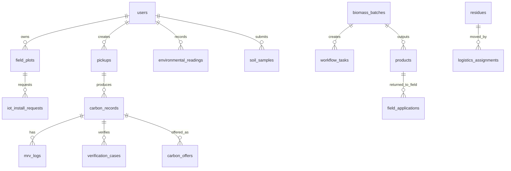

# GreenLoop Database Schema

GreenLoop uses `sql.js` with a persisted JSON database file at:

```text
greenloop-backend/greenloop.db.json
```

The schema is initialized in:

```text
greenloop-backend/src/db.js
```

## Entity Overview



## Core User And Auth Tables

### `users`

Stores accounts and roles.

| Column | Type | Notes |
|---|---|---|
| `id` | TEXT PK | UUID |
| `name` | TEXT | User name |
| `phone` | TEXT UNIQUE | Login identifier |
| `email` | TEXT UNIQUE | Optional login identifier |
| `password` | TEXT | bcrypt hash |
| `role` | TEXT | `farmer`, `htx`, `buyer`, `partner`, `admin` |
| `province` | TEXT | User location |
| `farm_ha` | REAL | Farmer farm size |
| `htx_code` | TEXT | Cooperative code |
| `created_at` | TEXT | Created timestamp |
| `last_login` | TEXT | Last login timestamp |

### `notifications`

Stores user or broadcast notifications.

| Column | Type | Notes |
|---|---|---|
| `id` | TEXT PK | UUID |
| `user_id` | TEXT | Nullable for broadcast |
| `title` | TEXT | Notification title |
| `body` | TEXT | Notification body |
| `type` | TEXT | `info`, `alert`, `success`, `warning` |
| `read` | INTEGER | 0/1 |
| `created_at` | TEXT | Created timestamp |

### `points`

Stores reward point events.

| Column | Type | Notes |
|---|---|---|
| `id` | TEXT PK | UUID |
| `user_id` | TEXT FK | `users.id` |
| `amount` | INTEGER | Points amount |
| `type` | TEXT | `earned`, `redeemed` |
| `reason` | TEXT | Reason |
| `ref_id` | TEXT | Related entity |
| `created_at` | TEXT | Created timestamp |

## Farmer Field And IoT Tables

### `field_plots`

Stores farmer field polygons.

| Column | Type | Notes |
|---|---|---|
| `id` | TEXT PK | UUID |
| `user_id` | TEXT FK | Owner, references `users.id` |
| `name` | TEXT | Field name |
| `province` | TEXT | Province |
| `area_ha` | REAL | Area in hectares |
| `crop_type` | TEXT | `rice`, `rice_shrimp`, etc. |
| `lat` | REAL | Centroid latitude |
| `lng` | REAL | Centroid longitude |
| `boundary` | TEXT | JSON array of `{lat,lng}` polygon points |
| `created_at` | TEXT | Created timestamp |
| `updated_at` | TEXT | Updated timestamp |

### `iot_install_requests`

Stores farmer requests for IoT installation.

| Column | Type | Notes |
|---|---|---|
| `id` | TEXT PK | UUID |
| `plot_id` | TEXT FK | References `field_plots.id` |
| `user_id` | TEXT FK | Farmer, references `users.id` |
| `status` | TEXT | `pending`, `approved`, `installed`, `rejected` |
| `requested_sensors` | TEXT | JSON array, default salinity/pH/moisture |
| `admin_id` | TEXT | Admin/HTX reviewer |
| `admin_notes` | TEXT | Review note |
| `requested_at` | TEXT | Request timestamp |
| `decided_at` | TEXT | Approval/rejection timestamp |
| `installed_at` | TEXT | Installation timestamp |

### `salinity_readings`

Stores salinity station or IoT readings.

| Column | Type | Notes |
|---|---|---|
| `id` | TEXT PK | UUID |
| `station` | TEXT | Station/sensor name |
| `province` | TEXT | Province |
| `river` | TEXT | River/canal |
| `value_gpl` | REAL | Salinity in g/L |
| `recorded_at` | TEXT | Reading time |
| `source` | TEXT | `mrc_api`, `iot_sensor`, etc. |
| `alert` | INTEGER | 1 if threshold exceeded |
| `created_at` | TEXT | Created timestamp |

### `environmental_readings`

Stores IoT or manual environmental readings.

| Column | Type | Notes |
|---|---|---|
| `id` | TEXT PK | UUID |
| `user_id` | TEXT FK | References `users.id` |
| `station` | TEXT | Sensor/station name |
| `province` | TEXT | Province |
| `metric` | TEXT | `ph`, `moisture`, `temperature`, `dissolved_oxygen`, etc. |
| `value` | REAL | Reading value |
| `unit` | TEXT | Unit |
| `sampled_at` | TEXT | Sampling time |
| `source` | TEXT | `manual`, `iot_sensor` |
| `alert` | INTEGER | 0/1 |
| `created_at` | TEXT | Created timestamp |

### `soil_samples`

Stores soil MRV measurements.

| Column | Type | Notes |
|---|---|---|
| `id` | TEXT PK | UUID |
| `user_id` | TEXT FK | References `users.id` |
| `ph` | REAL | Soil pH |
| `organic_matter_pct` | REAL | Organic matter |
| `moisture_pct` | REAL | Soil moisture |
| `soil_carbon_pct` | REAL | Soil carbon |
| `lab_name` | TEXT | Lab/source |
| `evidence_hash` | TEXT | Evidence hash |
| `sampled_at` | TEXT | Sample timestamp |
| `created_at` | TEXT | Created timestamp |

## Biomass Collection And Processing

### `pickups`

Stores biomass pickup bookings.

| Column | Type | Notes |
|---|---|---|
| `id` | TEXT PK | UUID |
| `user_id` | TEXT FK | Farmer, references `users.id` |
| `biomass_type` | TEXT | Biomass type |
| `quantity_kg` | REAL | Pickup quantity |
| `location` | TEXT | Pickup location |
| `province` | TEXT | Province |
| `scheduled_at` | TEXT | Scheduled pickup date |
| `status` | TEXT | `pending`, `confirmed`, `collected`, `processed`, `cancelled` |
| `notes` | TEXT | Notes |
| `htx_code` | TEXT | Cooperative code |
| `biochar_yield_kg` | REAL | Filled after processing |
| `created_at` | TEXT | Created timestamp |
| `updated_at` | TEXT | Updated timestamp |

### `biomass_batches`

Tracks biomass after intake.

| Column | Type | Notes |
|---|---|---|
| `id` | TEXT PK | UUID |
| `batch_code` | TEXT UNIQUE | Traceable batch code |
| `owner_id` | TEXT | User owner |
| `pickup_id` | TEXT | Related pickup |
| `biomass_type` | TEXT | Biomass type |
| `input_kg` | REAL | Input mass |
| `status` | TEXT | Batch lifecycle status |
| `custody_hash` | TEXT | Chain-of-custody hash |
| `created_at` | TEXT | Created timestamp |
| `updated_at` | TEXT | Updated timestamp |

### `workflow_tasks`

Operational tasks tied to batches or roles.

| Column | Type | Notes |
|---|---|---|
| `id` | TEXT PK | UUID |
| `batch_id` | TEXT | Optional batch |
| `title` | TEXT | Task title |
| `assignee_role` | TEXT | Role owner |
| `status` | TEXT | `open`, `in_progress`, `blocked`, `done` |
| `due_at` | TEXT | Due date |
| `notes` | TEXT | Notes |
| `created_at` | TEXT | Created timestamp |
| `completed_at` | TEXT | Completion timestamp |

### `products`

Stores processed outputs such as biochar or biomaterials.

| Column | Type | Notes |
|---|---|---|
| `id` | TEXT PK | UUID |
| `batch_id` | TEXT | Source batch |
| `name` | TEXT | Product name |
| `category` | TEXT | Product category |
| `quantity_kg` | REAL | Quantity |
| `unit_price_vnd` | REAL | Unit price |
| `status` | TEXT | Product status |
| `carbon_record_id` | TEXT | Related carbon record |
| `created_at` | TEXT | Created timestamp |
| `source_residue_id` | TEXT | Optional residue source |
| `conversion_pathway_id` | TEXT | Optional pathway |
| `description` | TEXT | Product description |
| `unit` | TEXT | Unit |
| `channel` | TEXT | `market`, `bio_refinery`, `farm_return` |
| `return_to_field` | INTEGER | 0/1 |

## Carbon And MRV

### `carbon_records`

Stores carbon footprint and credit records.

| Column | Type | Notes |
|---|---|---|
| `id` | TEXT PK | UUID |
| `user_id` | TEXT FK | Farmer, references `users.id` |
| `pickup_id` | TEXT | Source pickup |
| `biochar_kg` | REAL | Biochar amount |
| `co2e_tonnes` | REAL | Estimated or verified tCO2e |
| `methodology` | TEXT | Default `Verra VM0044` |
| `status` | TEXT | `pending`, `verified`, `issued`, `traded` |
| `passport_hash` | TEXT | Passport/evidence hash |
| `scu_units` | REAL | Carbon units |
| `revenue_usd` | REAL | Revenue |
| `season` | TEXT | Season context |
| `created_at` | TEXT | Created timestamp |
| `verified_at` | TEXT | Verification timestamp |

### `mrv_logs`

Stores MRV actions.

| Column | Type | Notes |
|---|---|---|
| `id` | TEXT PK | UUID |
| `carbon_id` | TEXT FK | References `carbon_records.id` |
| `tier` | INTEGER | MRV tier |
| `action` | TEXT | Action |
| `data_hash` | TEXT | Evidence hash |
| `operator` | TEXT | Operator |
| `notes` | TEXT | Notes |
| `logged_at` | TEXT | Timestamp |

### `verification_cases`

Stores carbon verification cases.

| Column | Type | Notes |
|---|---|---|
| `id` | TEXT PK | UUID |
| `carbon_id` | TEXT FK | References `carbon_records.id` |
| `status` | TEXT | Verification status |
| `validator` | TEXT | Validator name |
| `evidence_hash` | TEXT | Evidence hash |
| `notes` | TEXT | Notes |
| `created_at` | TEXT | Created timestamp |
| `verified_at` | TEXT | Verified timestamp |

## Marketplace And Finance

### `carbon_offers`

Stores carbon credit sale offers.

| Column | Type | Notes |
|---|---|---|
| `id` | TEXT PK | UUID |
| `carbon_id` | TEXT FK | References `carbon_records.id` |
| `seller_id` | TEXT FK | Seller user |
| `tonnes` | REAL | Offered tCO2e |
| `price_per_tonne_usd` | REAL | Price |
| `status` | TEXT | `open`, etc. |
| `created_at` | TEXT | Created timestamp |

### `carbon_trade_requests`

Stores buyer interest in carbon offers.

| Column | Type | Notes |
|---|---|---|
| `id` | TEXT PK | UUID |
| `offer_id` | TEXT FK | References `carbon_offers.id` |
| `buyer_id` | TEXT FK | Buyer user |
| `tonnes` | REAL | Requested quantity |
| `message` | TEXT | Buyer message |
| `status` | TEXT | `pending`, `accepted`, `rejected`, `cancelled` |
| `created_at` | TEXT | Created timestamp |
| `updated_at` | TEXT | Updated timestamp |

### `finance_applications`

Stores green finance or insurance applications.

| Column | Type | Notes |
|---|---|---|
| `id` | TEXT PK | UUID |
| `user_id` | TEXT FK | Applicant |
| `product_type` | TEXT | `credit`, `insurance` |
| `amount_vnd` | REAL | Requested amount |
| `purpose` | TEXT | Purpose |
| `readiness_score` | INTEGER | Readiness score |
| `status` | TEXT | Application status |
| `evidence_hash` | TEXT | Evidence hash |
| `created_at` | TEXT | Created timestamp |
| `updated_at` | TEXT | Updated timestamp |

## Biomass Value Tables

### `residues`

Tracks residue sources before collection or conversion.

### `conversion_pathways`

Defines how residue types become outputs.

### `logistics_routes`

Stores HTX collection routes.

### `logistics_assignments`

Tracks custody handoffs and delivery assignments.

### `field_applications`

Tracks products returned to fields, such as biochar application.

### `certificates`

Stores ESG, traceability or compliance certificates.

### `partners`

Stores partner organizations.

### `partner_requests`

Stores partner requests and payloads.

### `refinery_runs`

Stores processing/refinery runs for biomass batches.

### `farm_ecosystem_profiles`

Stores farmer ecosystem setup and practices.

### `audit_events`

Stores audit trail entries for important system actions.

## Key Relationships

- `users.id` -> `pickups.user_id`
- `users.id` -> `field_plots.user_id`
- `field_plots.id` -> `iot_install_requests.plot_id`
- `pickups.id` -> `carbon_records.pickup_id`
- `carbon_records.id` -> `mrv_logs.carbon_id`
- `carbon_records.id` -> `verification_cases.carbon_id`
- `carbon_records.id` -> `carbon_offers.carbon_id`
- `carbon_offers.id` -> `carbon_trade_requests.offer_id`
- `biomass_batches.id` -> `workflow_tasks.batch_id`
- `biomass_batches.id` -> `products.batch_id`
- `products.id` -> `field_applications.product_id`

## Current Hackathon Focus

The most important tables for the narrowed IoT + carbon-footprint demo are:

1. `users`
2. `field_plots`
3. `iot_install_requests`
4. `environmental_readings`
5. `salinity_readings`
6. `pickups`
7. `carbon_records`
8. `mrv_logs`
9. `verification_cases`
